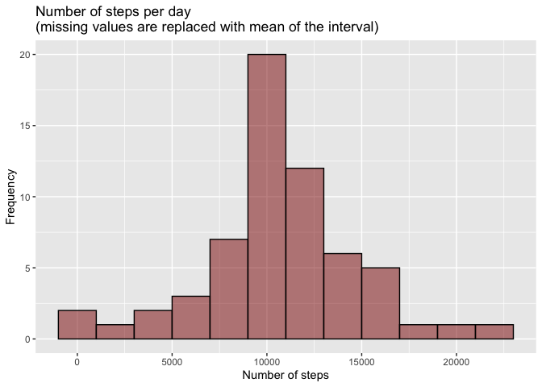
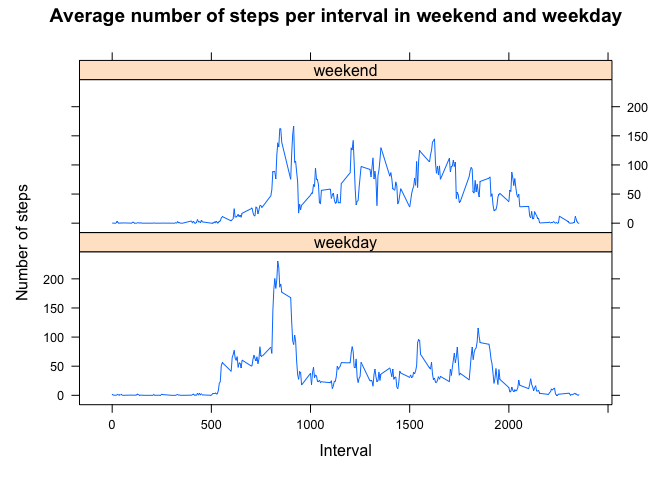

```r
library(ggplot2)
library(lattice)
library(dplyr)
```

```
## 
## Attachement du package : 'dplyr'
```

```
## Les objets suivants sont masqués depuis 'package:stats':
## 
##     filter, lag
```

```
## Les objets suivants sont masqués depuis 'package:base':
## 
##     intersect, setdiff, setequal, union
```

```r
library(lubridate)
```

```
## 
## Attachement du package : 'lubridate'
```

```
## Les objets suivants sont masqués depuis 'package:base':
## 
##     date, intersect, setdiff, union
```


## Loading and preprocessing the data
The data analysed are described in the csv file `data/activity.csv`. These data are 
loaded in the dataset _activities_.

Three variables are described in _activities_ : 

- date [Date] : date of the measurement in the format "yyyy/MM/dd"  
- interval [int] : identifier for the 5 minutes interval in which the measurement was taken  
- steps [int] : the number of steps for that date and that interval  


```r
activities <- read.csv("data/activity.csv") %>%
  mutate(date = as.Date(date))

print(str(activities))
```

```
## 'data.frame':	17568 obs. of  3 variables:
##  $ steps   : int  NA NA NA NA NA NA NA NA NA NA ...
##  $ date    : Date, format: "2012-10-01" "2012-10-01" ...
##  $ interval: int  0 5 10 15 20 25 30 35 40 45 ...
## NULL
```

```r
print(summary(activities))
```

```
##      steps             date               interval     
##  Min.   :  0.00   Min.   :2012-10-01   Min.   :   0.0  
##  1st Qu.:  0.00   1st Qu.:2012-10-16   1st Qu.: 588.8  
##  Median :  0.00   Median :2012-10-31   Median :1177.5  
##  Mean   : 37.38   Mean   :2012-10-31   Mean   :1177.5  
##  3rd Qu.: 12.00   3rd Qu.:2012-11-15   3rd Qu.:1766.2  
##  Max.   :806.00   Max.   :2012-11-30   Max.   :2355.0  
##  NA's   :2304
```

## What is mean total number of steps taken per day?
A new dataframe, _steps_per_day_, is created from _activities_. This dataframe 
contains two variables :

- date [Date] : the day in which the measurements was taken  
- steps [int] : the total number of steps for that day  

_steps_per_day_ is cleaned from all missing values in _activitoes_.


```r
steps_per_day <- activities[complete.cases(activities),] %>% 
  select(date, steps) %>%
  group_by(date) %>%
  summarise(steps = sum(steps))
```

The results are shown in the following history plot.  

```r
p <- ggplot(steps_per_day, aes(date, steps)) +
    geom_bar(stat="identity", na.rm = TRUE) +
    ggtitle("Number of steps per day") +
    xlab("Date") + 
    ylab("Number of steps")
p
```

<!-- -->


```r
mean_steps <- format(mean(steps_per_day$steps), scientific=FALSE)
median_steps <- median(steps_per_day$steps)
```
The mean of steps per day is **10766.19** and the median is **10765**.

## What is the average daily activity pattern?
The dataframe _average_steps_per_interval_ is created from _activities_ (cleaned 
from its missing values) : 

- interval [int] : identifier for the 5 minutes interval in which the measurement was taken 
- steps [int] : the mean value of steps for that interval


```r
average_steps_per_interval <- activities[complete.cases(activities),] %>% 
  select(interval, steps) %>%
  group_by(interval) %>%
  summarise(steps = mean(steps))
```

The dataframe is shown in a line graph below, showing the maximum value.

```r
max_interval = average_steps_per_interval %>%
  filter(steps >= max(steps))

p <- ggplot(average_steps_per_interval, aes(interval, steps)) +
    geom_line(linetype = "solid") +
    ggtitle("Average number of steps per interval") +
    xlab("Interval") + 
    ylab("Number of steps") +
    geom_segment(aes(x = max_interval$interval[1]+100, y = max_interval$steps[1], 
                     xend = max_interval$interval[1], yend = max_interval$steps[1]),
                  arrow = arrow(length = unit(0.2, "cm"))) +
    geom_text(aes(x = max_interval$interval[1] + 350, y = max_interval$steps[1]), 
              label = paste0("(", max_interval$interval[1], " , ", 
                             format(max_interval$steps[1], scientific = FALSE), ")"), 
              color = "red")
p
```

<!-- -->

The interval **835** gives the maximum value of steps 
for all days with an average value of **206.1698**.

## Imputing missing values


```r
number_NA_values = count(activities[is.na(activities),])[1, 1]
```

We have 2304 missing values in _activities_, the original dataframe.  
The dataframe _activities_no_missing_ is created from _activities_ by replacing 
the missing values with the median value of the corresponding interval.  


```r
activities_no_missing <- activities %>% 
  group_by(interval) %>% 
  mutate(avg.Interval = median(steps, na.rm = TRUE)) %>%
  ungroup() %>%
  group_by(date) %>%
  mutate(steps = ifelse(is.na(steps), avg.Interval, steps)) %>%
  ungroup() %>%
  select(date, interval, steps)
```

The dataframe _steps_per_day_with_missing_ is built from _activities_no_missing_ :

- date [Date] : the day in which the measurements was taken  
- steps [int] : the total number of steps for that day  


```r
steps_per_day_with_missing <- activities_no_missing %>% 
  select(date, steps) %>%
  group_by(date) %>%
  summarise(steps = sum(steps))
```

The results are shown in the following history plot.  

```r
p <- ggplot(steps_per_day_with_missing, aes(date, steps)) +
    geom_bar(stat="identity", na.rm = TRUE) +
    ggtitle("Number of steps per day\n(missing values are replaced with median of the interval)") +
    xlab("Date") + 
    ylab("Number of steps")
p
```

<!-- -->


```r
mean_steps_with_missing <- format(mean(steps_per_day_with_missing$steps), scientific=FALSE)
median_steps_with_missing <- format(median(steps_per_day_with_missing$steps), scientific = FALSE)
```
The mean of steps per day is **9503.869** and the median is 
**10395**.

## Are there differences in activity patterns between weekdays and weekends?
The dataframe _mean_steps_per_interval_day_ is created from _activities_no_missing_ :

- day [Factor] : weekday or weekend depending on the date 
- interval [int] : identifier for the 5 minutes interval in which the measurement was taken 
- steps [int] : the mean value of steps for that day and interval


```r
activities_days <- activities_no_missing %>% 
  mutate(day = ifelse(wday(date) %in% c(1,7), "weekend", "weekday"))
activities_days$day <- as.factor(activities_days$day)
mean_steps_per_interval_day <- distinct(activities_days %>% 
  group_by(interval, day) %>% 
  mutate(steps = mean(steps)) %>% 
  ungroup() %>%
  select(interval, steps, day))
```

The results are shown in the graph below :

```r
xyplot(steps~interval | day, 
       data = mean_steps_per_interval_day, 
       layout = c(1,2), 
       ylab = "Number of steps", 
       xlab = "Interval", 
       type = 'l',
       main = "Average number of steps per interval in weekend and weekday")
```

<!-- -->

The number of steps is globally higher during the weekend compare to the rest of 
the week.

